# Citation Relationship Graph — Phase 3

```mermaid
graph TD
    subgraph "Theoretical Foundations"
        Mayne2005["Mayne et al. 2005/2006<br/>Tube MPC<br/>(RPI sets, tube construction)"]
        Rawlings2017["Rawlings, Mayne, Diehl 2017<br/>MPC: Theory and Design<br/>(Textbook)"]
        Ames2019["Ames et al. 2019<br/>Control Barrier Functions"]
        Achiam2017["Achiam et al. 2017<br/>Constrained Policy Optimization"]
        Ziebart2008["Ziebart et al. 2008<br/>Maximum Entropy IRL"]
        Kumar2020["Kumar et al. 2020<br/>Conservative Q-Learning"]
    end

    subgraph "Architectural Predecessors"
        Vaaler2024["Vaaler et al. 2024<br/>RL + PSF for Marine Navigation<br/>(Modular safety filter)"]
        Zanon2021["Zanon & Gros 2021<br/>Safe RL using Robust MPC<br/>(MPC as safety filter)"]
        Gros2022["Gros & Zanon 2022<br/>Learning for MPC with Safety Guarantees"]
        Reiter2025["Reiter et al. 2025<br/>RL-MPC Integration Survey<br/>(3 archetypes)"]
    end

    subgraph "Our Framework"
        L1["L1: Preference-RL<br/>CQL + MaxEnt IRL<br/>(cost function parameterization)"]
        L2["L2: Tube MPC<br/>RPI + tightened constraints<br/>(safety guarantee)"]
        L3["L3: Tube-Constrained DWA<br/>(real-time dynamic avoidance)"]
        Proof["Proposition 1<br/>Safety ∀ w ∈ W_bounded<br/>(Lemma 1→2→3)"]
    end

    subgraph "Application Domain"
        CaBot["CaBot (Guerreiro et al. 2019)<br/>Robotic guide platform"]
        Dakopoulos["Dakopoulos & Bourbakis 2010<br/>ETA survey"]
        Fox1997["Fox et al. 1997<br/>DWA algorithm"]
    end

    subgraph "Competing Approaches"
        RLonly["RL-only (SAC)<br/>End-to-end navigation"]
        RL_CBF["RL + CBF<br/>Constrained exploration"]
        HandTuned["Hand-Tuned MPC<br/>Fixed-weight baseline"]
    end

    %% Direct citation relationships
    Mayne2005 -->|"⊃ includes"| L2
    Rawlings2017 -->|"⊃ includes"| L2
    Ames2019 -->|"↔ alternative to"| L2
    Kumar2020 -->|"→ used by"| L1
    Ziebart2008 -->|"→ used by"| L1
    
    Vaaler2024 -->|"→ architectural inspiration"| Proof
    Vaaler2024 -->|"≠ differs: action filter vs cost param"| L2
    Zanon2021 -->|"→ safety filter concept"| L2
    Gros2022 -->|"→ recursive feasibility"| Proof
    Reiter2025 -->|"⊃ classifies as Archetype 2"| Proof

    L1 -->|"parameterizes cost function"| L2
    L2 -->|"provides tube + reference"| L3
    L2 -->|"proves safety"| Proof
    
    CaBot -->|"deployment target"| L3
    Dakopoulos -->|"background context"| L1
    Fox1997 -->|"→ base algorithm extended by"| L3

    RLonly -->|"↔ outperformed by"| Proof
    RL_CBF -->|"↔ outperformed by"| Proof
    HandTuned -->|"↔ outperformed by"| Proof
```

## Relationship Types

| Symbol | Meaning | Examples in Graph |
|--------|---------|------------------|
| `→` | Direct citation / technical continuation | Kumar 2020 → L1, Fox 1997 → L3 |
| `↔` | Comparison (different methods, same problem) | Our method vs RL-only, RL+CBF |
| `⊃` | Contains / generalizes | Mayne 2005 ⊃ L2 (Tube MPC theory) |
| `≠` | Key difference / improvement over | Vaaler 2024 ≠ Our method (action-filter vs cost-param) |

## Key Observation

The citation graph reveals that our paper sits at the **intersection of three previously separate research streams**:

1. **Tube MPC theory** (Mayne line) — traditionally applied to autonomous vehicles/UAVs, not assistive tech
2. **Safe RL / safety filters** (Zanon-Gros line, Vaaler) — developed for autonomous systems, not human-collaborative
3. **BVI assistive navigation** (CaBot, ETA line) — safety mechanisms are ad-hoc, no formal guarantees

Our paper creates a **novel bridge** between streams 1+2 and stream 3, while also innovating within streams 1+2 through the cost-function-parameterization interface (vs action-filtering in all prior safety filter work).
